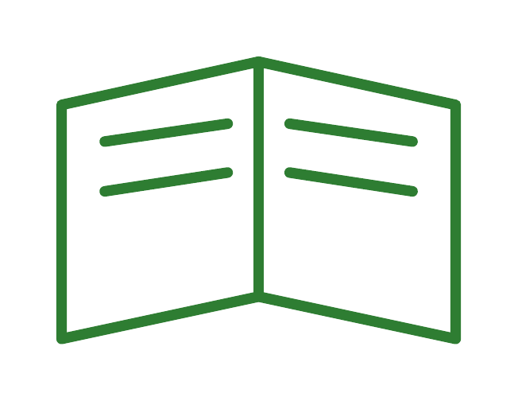

<p align="center"></p>

# Aprendo a leer

[](https://github.com/konradcinkusz/learning-to-read/actions/workflows/build.yml)
[](LICENSE)
[](preamble.tex)

Tres cuadernos diarios de lectura en español, uno por nivel, y uno en
inglés, con la misma familia (los dos primeros cuentan el mismo año con
los mismos temas semana a semana; el tercero, el año siguiente; el de
inglés, ese mismo año siguiente, desde la casa de al lado):

- **Nivel 1 · Primeras palabras** (`palabras.tex`) -- para quien empieza
  a juntar sílabas: una palabra al día, partida en sílabas, y casi
  siempre un dibujo. Ver "El cuaderno de primeras palabras" más abajo.
- **Nivel 2 · Frases** (`main.tex`) -- el cuaderno original, para quien
  ya lee frases completas. Es lo que describe el resto de esta
  introducción.
- **Nivel 3 · Leo con lupa** (`lupa.tex`) -- el año siguiente, para
  quien ya lee con soltura: oraciones complejas en párrafos y una
  actividad de análisis cada día. Ver "Leo con lupa" más abajo.
- **Read and Draw** (`english.tex`) -- todo en inglés, un nivel por
  debajo de *Leo con lupa*: textos cortos hechos de oraciones compuestas
  (*because*, *when*, *who*...) y cada día un análisis muy sencillo de lo
  leído, casi siempre un dibujo. Ver "Read and Draw" más abajo.
  *En construcción:* se escribe por partes del año, una por PR.

Cuaderno diario de lectura en español, en A4, una página por día
laborable (lunes a viernes, 260 días = un año completo, de una estación
a la siguiente -- no "un curso" en el sentido escolar: se lee también
en vacaciones, ver "Estado" más abajo). Cada página tiene un hueco para
la fecha y una nota del adulto, la frase (o frases) del día, y una
actividad corta (dibujar, completar unas líneas sueltas, copiar la
frase, responder, relacionar, adivinar o crear).

Pensado para una niña que ya vive y escolariza en español y está
consolidando la lectura, no para empezar desde cero: las frases son
completas desde el primer día, y lo que aumenta con el curso es cuántas
frases hay que leer (1 → 2 → 3 → 4, una vez por trimestre) y su
complejidad, no el alfabeto disponible.

Además de los 260 días, el cuaderno trae una medalla al final de cada
trimestre, una clave de respuestas para las páginas de Adivina y
Relaciona, y una actividad más en la rotación diaria, **Traza**: de vez
en cuando (cada dos semanas más o menos, repartida por todo el año),
en vez de dibujar se repasa el contorno real de una letra -- mayúscula
y minúscula, sacado del glifo real de la fuente del cuaderno, no un
dibujo aparte -- hasta cubrir las 27 letras del abecedario. Ver
"Estructura" más abajo.

Ver `notes/01-curriculum.md` para el plan completo del curso (reparto
de personajes, arco de cada trimestre, disciplina de vocabulario, qué
falta escribir) y `notes/02-revision-y-plan.md` para la revisión del
cuaderno y el plan de desarrollo del resto del año.

## El cuaderno de primeras palabras (nivel 1)

El nivel anterior al de frases: mismo calendario (260 días, cuatro
trimestres = cuatro estaciones, medalla al final de cada uno), mismos
personajes y mismo tema cada semana -- si en casa hay dos hermanos,
cada uno lleva su cuaderno y esa semana leen los dos sobre lo mismo --,
pero lo que se lee es mucho más sencillo:

| Trimestre | Qué se lee | Qué sílabas |
|---|---|---|
| 1 (otoño) | 1 palabra al día | solo directas: *ma·má, pa·to*; tres sílabas desde la semana 6 (*o·to·ño*) |
| 2 (invierno) | 2 palabras al día | + cerradas (*sol, bu·fan·da*), *c*/*g* suaves (*ce, gi*), *h* |
| 3 (primavera) | 3 palabras al día | todas: trabadas (*li·bro*), *ch, ll, rr, qu, gu*, diptongos (*a·bue·la*) |
| 4 (verano) | 1 frase de 2 a 4 palabras | el puente hacia el nivel 2, que empieza en 6–8 palabras |

Cada palabra se imprime partida en sílabas y entera, y casi todas las
actividades terminan dibujando (dibuja, completa, traza, escribe
repasando letras huecas, encuentra la palabra, palmadas por sílaba,
adivina y dibuja, une, ¿sí o no?, y el viernes relee la semana) -- la
caja de actividad ocupa todo lo que queda de página, para que haya
sitio de verdad para dibujar.

La escalera de sílabas no es una intención editorial: está en
`tools/gen_palabras.py` (`ESCALERA`) y el generador falla si una
palabra se la salta. Cada palabra se escribe en el JSON ya partida
(`"pe-lo-ta"`), y ese silabeo tiene que coincidir con el automático de
`tools/silabas.py` -- dos fuentes que tienen que estar de acuerdo. Ver
`notes/03-nivel-palabras.md` para el diseño completo.

## Leo con lupa (nivel 3)

El año siguiente al cuaderno de frases: la misma niña, un año mayor, y
un nivel por encima. Mismo formato (A4, 260 días, cuatro trimestres que
son las cuatro estaciones, medallas y diploma) y mismos personajes,
pero:

- **el texto está hecho de oraciones complejas** -- subordinadas con
  *que*, *porque*, *aunque*, *cuando*, *si*, *para que*, *antes de
  que*... --, en párrafos de 55 palabras al principio a unas 120 al
  final, primero en presente y desde el invierno narrado en pasado, con
  cartas, recetas, instrucciones, entrevistas, textos informativos, un
  diario, poemas y noticias;
- **cada actividad obliga a analizar lo leído**: dibujar exactamente lo
  que describe el texto (*Dibuja con lupa*: cuántos, de qué color,
  dónde, y luego comprobarlo con preguntas que mandan de vuelta al
  texto), resolver el caso de la semana con las pistas repartidas de
  lunes a jueves (*Resuelve el caso*), tablas lógicas, mapas en
  cuadrícula con indicaciones, mensajes secretos cuyo código explica el
  texto, cazar los errores de un resumen equivocado, ordenar sucesos,
  fichas de textos informativos, comparar...

Lucía recibe la lupa de su bisabuelo relojero y funda con sus amigos el
*Club de la Lupa*: cada semana es un capítulo, casi siempre con un caso,
y cada trimestre tiene uno grande (¿quién es *Lector X*?, el mapa del tesoro de la abuela, la
cápsula del tiempo del colegio, el tesoro del pueblo). Al generar el
libro se comprueba a máquina lo que se puede comprobar de cada actividad
-- que cada tabla lógica tenga una sola solución, que cada ruta de un
mapa llegue a donde dice, que cada corrección de *Caza los errores* esté
de verdad en el texto de la semana -- y todo lo que tiene solución va a
una clave de respuestas al final del cuaderno. La escalera
(`content/lupa/progresion.json`) mide, además de palabras y longitud de
frase, un mínimo de oraciones subordinadas por texto. Ver
`notes/04-nivel-lupa.md` para el diseño completo: escalera, catálogo de
actividades y plan de las 52 semanas.

## Read and Draw (en inglés)

El cuarto cuaderno, y el único que no es en español: **todo** está en
inglés (británico) -- el texto, las instrucciones, la portada, la página
para el adulto, la clave y el diploma --, para la misma niña, que ya lee
con soltura en español y está aprendiendo inglés en el colegio. Es un
nivel por debajo de *Leo con lupa*, con su misma página (A4, 260 días,
cuatro partes = cuatro estaciones, medallas y diploma):

- **textos cortos, de oraciones compuestas**: de unas 30 palabras en
  otoño a unas 70 en verano, pero siempre con alguna subordinada
  (*because*, *when*, *who*, *that*, *if*, *before*...) -- una por texto
  al principio, tres al final --, en presente hasta el invierno y en
  pasado desde la primavera;
- **cada día, un análisis muy sencillo de lo leído**: dibujar
  exactamente lo que dice el texto (*Read and draw*), colorear un dibujo
  como dice (*Read and colour*), dibujar cosas en su sitio en una escena
  (*Where is it?*: *in*, *on*, *under*, *next to*...), *Yes or no?*,
  rodear, unir, unir las dos mitades de una frase compuesta del texto
  (*Match the halves*), la palabra que falta, ordenar la historia,
  adivinanzas y, cada viernes, la semana en tres dibujos o un repaso.
  Cada actividad lleva un icono (un lápiz, una cera, una casilla...),
  explicado con su palabra al principio del cuaderno.

La familia de siempre y unos vecinos nuevos, que son la razón de que
todo esté en inglés: los Brown llegan de Londres -- Amy, que acaba en la
clase de Lucía y dibuja las palabras que no sabe decir en español; Sam,
su hermano, y Pip, un loro verde que habla. Al generar el libro se
comprueba a máquina lo que se puede comprobar: que cada frase de *The
missing words* y de *Match the halves* esté tal cual en el texto de la
semana, que el inglés sea británico y que no se cuele nada del español.
Ver `notes/05-english.md` para el diseño completo: escalera, actividades,
reparto y el plan de las 52 semanas.

## Descargar el PDF sin instalar nada

Nivel 1, primeras palabras:
**[⬇ PDF (color)](https://konradcinkusz.github.io/learning-to-read/aprendo-a-leer-palabras.pdf)**
· **[⬇ PDF (blanco y negro)](https://konradcinkusz.github.io/learning-to-read/aprendo-a-leer-palabras-bn.pdf)**

Nivel 2, frases:
**[⬇ PDF (color)](https://konradcinkusz.github.io/learning-to-read/aprendo-a-leer.pdf)**
· **[⬇ PDF (blanco y negro)](https://konradcinkusz.github.io/learning-to-read/aprendo-a-leer-bn.pdf)**

Nivel 3, Leo con lupa:
**[⬇ PDF (color)](https://konradcinkusz.github.io/learning-to-read/leo-con-lupa.pdf)**
· **[⬇ PDF (blanco y negro)](https://konradcinkusz.github.io/learning-to-read/leo-con-lupa-bn.pdf)**

*Read and Draw*, en inglés, se publicará aquí en cuanto esté entero;
mientras se escribe, cada build deja sus PDF en los artefactos
`pdf-english-color` / `pdf-english-bw` (ver más abajo).

Enlaces fijos, publicados por GitHub Pages en cada push a `main` (ver
`.github/workflows/pages.yml`). Las dos versiones tienen exactamente el
mismo contenido y la misma paginación — la de blanco y negro es para
imprimir sin gastar tinta de color, no una versión reducida: nada en el
cuaderno se distingue solo por el color (el título en negrita de cada
caja ya dice qué actividad es).

Si esos enlaces todavía no responden (por ejemplo, justo después de
activar Pages por primera vez, antes de que corra el primer
despliegue), los mismos PDF están también en la pestaña
[*Actions*](https://github.com/konradcinkusz/learning-to-read/actions/workflows/build.yml)
→ el último run de *Build* → artefactos `pdf-color` / `pdf-bw` /
`pdf-palabras-color` / `pdf-palabras-bw` / `pdf-lupa-color` /
`pdf-lupa-bw` (se guardan 30 días, hace falta estar identificado en
GitHub para descargarlos).

## Construir el PDF a mano

Necesita una distribución de TeX con **LuaLaTeX** (no pdflatex: la letra
del cuaderno es Andika, cargada con `fontspec` desde `fonts/andika/` —
ver preamble.tex) + `latexmk`, con `babel`, `tcolorbox`, `tikz` y
`fontspec` — cualquier TeX Live razonablemente completo los trae.

```sh
make              # genera, compila el cuaderno de frases (color), comprueba
make palabras     # lo mismo para el cuaderno de primeras palabras (color)
make lupa         # lo mismo para Leo con lupa (color)
make english      # lo mismo para Read and Draw, en inglés (color)
make all-formats  # los ocho PDF: palabras, frases, lupa y english, color Y blanco-y-negro
make generate     # solo regenera los .tex de los cuatro cuadernos desde el JSON
make build        # solo compila frases en color (asume que ya está generado)
make build-bw     # solo compila frases en blanco y negro
make build-palabras / build-palabras-bw   # lo mismo, primeras palabras
make check        # lee main.log + 1 día = 1 página (lee main.aux) + valida el JSON
make check-bw     # lo mismo, sobre main-bw.log / main-bw.aux
make check-palabras / check-palabras-bw   # lo mismo, primeras palabras (+ silabeo)
make build-lupa / build-lupa-bw           # lo mismo, Leo con lupa
make check-lupa / check-lupa-bw           # lo mismo, Leo con lupa (+ actividades y escalera)
make build-english / build-english-bw     # lo mismo, Read and Draw
make check-english / check-english-bw     # lo mismo, Read and Draw (+ actividades, inglés británico y escalera)
make clean
```

## Estructura

```
main.tex, main-bw.tex                 -- cuaderno de frases, color y blanco-y-negro; solo fijan \bookcolor
palabras.tex, palabras-bw.tex         -- cuaderno de primeras palabras, color y blanco-y-negro
lupa.tex, lupa-bw.tex                 -- Leo con lupa (nivel 3), color y blanco-y-negro
english.tex, english-bw.tex           -- Read and Draw (en inglés), color y blanco-y-negro
preamble.tex, lang/es.tex             -- el motor LaTeX (la paleta de main-bw.tex está en preamble.tex)
lang/en.tex                           -- las cadenas en inglés (\booklang = en, ver preamble.tex)
preamble-palabras.tex                 -- lo propio del cuaderno de primeras palabras (tarjetas, cajas que llenan la página)
preamble-lupa.tex                     -- lo propio de Leo con lupa (caja de actividad a toda página, mapas, tablas, códigos, la lupa)
preamble-english.tex                  -- lo propio de Read and Draw (sobre preamble-lupa.tex: letra más grande, piezas de sus actividades, iconos)
body.tex, body-palabras.tex, body-lupa.tex, body-english.tex -- orden del documento de cada cuaderno
frontmatter/                          -- portada, instrucciones, mapa del curso (frontmatter/palabras/: nivel 1; frontmatter/lupa/: nivel 3, con "Cómo lee un detective" y el carné del club; frontmatter/english/: en inglés, con los iconos de las actividades y "Who's who?")
content/q1.json, q2.json, q3.json, q4.json  -- los 260 días, uno por trimestre, editados a mano
content/generated-days.tex            -- GENERADO por tools/gen_days.py, no editar
content/progresion.json               -- objetivos semanales de la escalera de progresión (52 filas)
content/generated-clave.tex           -- GENERADO por tools/gen_days.py, no editar
content/letras-trazo.json             -- contorno real de cada letra (Andika), generado por tools/gen_letras_puntos.py
content/palabras-trazo.json           -- palabra de ejemplo de cada letra ("A de Abuela"), editado a mano
content/palabras/q1.json ... q4.json  -- los 260 días del cuaderno de primeras palabras, editados a mano
content/palabras/generated-*.tex      -- GENERADO por tools/gen_palabras.py, no editar
content/lupa/q1.json ... q4.json      -- los 260 días de Leo con lupa, editados a mano
content/lupa/progresion.json          -- la escalera de Leo con lupa (palabras, frase más larga, subordinadas)
content/lupa/generated-*.tex          -- GENERADO por tools/gen_days.py --libro lupa, no editar
content/english/q1.json ... q4.json   -- los días de Read and Draw, editados a mano
content/english/progresion.json       -- la escalera de Read and Draw (palabras, frase más larga, subordinadas)
content/english/vocabulario-base.json -- el inglés que se da por sabido (para el aviso de vocabulario nuevo)
content/english/generated-*.tex       -- GENERADO por tools/gen_days.py --libro english, no editar
diagrams/                             -- dibujos de línea (TikZ) para las páginas "Completa"
diagrams/english/                     -- dibujos para colorear y escenas donde dibujar, de Read and Draw
backmatter/diploma.tex, clave-respuestas.tex -- diploma y clave de respuestas (backmatter/palabras/: nivel 1; backmatter/lupa/: nivel 3; backmatter/english/: en inglés)
fonts/andika/                         -- letra del cuaderno (Andika, SIL, OFL -- ver "Licencia")
tools/gen_days.py                     -- JSON -> LaTeX + validación + medallas + clave de respuestas + trazo (frases, y Leo con lupa con --libro lupa)
tools/libros.py                       -- lo que distingue el cuaderno de frases de Leo con lupa: rutas, reglas, tipos de actividad
tools/lupa.py                         -- plantillas y comprobaciones de las actividades de Leo con lupa (tablas lógicas, mapas, errores...)
tools/english.py                      -- lo mismo para Read and Draw (frases del texto, inglés británico, sin español)
tools/comun.py                        -- lo que comparten gen_days.py y lupa.py
tools/gen_palabras.py                 -- lo mismo para el cuaderno de primeras palabras, + la escalera de sílabas
tools/silabas.py                      -- silabeo automático del español y rasgos de cada sílaba (cerrada, trabada...)
tools/gen_letras_puntos.py            -- fuente -> contorno de cada letra (matplotlib/fonttools; no forma parte de `make`)
tools/check_pages.py                  -- comprueba que cada día ocupa una sola página
tools/checklog.py                     -- lee el .log de LuaLaTeX correctamente (nunca grep '^!')
tools/metricas.py                     -- mide palabras/frase/vocabulario nuevo contra content/progresion.json (y subordinadas, con --libro lupa o --libro english)
docs/index.html                       -- la página que publica .github/workflows/pages.yml
assets/logo.tex, logo.png, logo.svg   -- logo del repositorio (standalone TikZ, reutiliza el icono de portada.tex)
LICENSE, LICENSE-CODE, LICENSE-CONTENT -- ver "Licencia" más abajo
CONTRIBUTING.md                       -- cómo colaborar (o hacer tu propio fork)
.github/workflows/build.yml           -- compila (color + blanco-y-negro) y valida en cada push/PR
.github/workflows/pages.yml           -- publica los dos PDF en GitHub Pages en cada push a main
notes/01-curriculum.md                -- el plan del curso completo
notes/02-revision-y-plan.md           -- revisión del cuaderno y plan de desarrollo del resto del año
notes/03-nivel-palabras.md            -- diseño del cuaderno de primeras palabras (nivel 1)
notes/04-nivel-lupa.md                -- diseño de Leo con lupa (nivel 3): escalera, actividades, reparto y las 52 semanas
notes/05-english.md                   -- diseño de Read and Draw (en inglés): escalera, actividades, reparto, las 52 semanas y las fases
```

## Licencia

El motor -- LaTeX (`preamble*.tex`, `lang/*.tex`, `main*.tex`, `palabras*.tex`, `lupa*.tex`, `english*.tex`, `body*.tex`),
las herramientas Python (`tools/`), el `Makefile` y la configuración de CI
(`.github/`) -- está bajo MIT ([`LICENSE-CODE`](LICENSE-CODE)): reutilízalo
libremente, incluido un fork para otro niño o niña.

El contenido narrativo -- las frases, las palabras, los nombres y la
trama de `content/*.json`, `content/palabras/*.json`,
`content/lupa/*.json` y `content/english/*.json`, y lo que se genera de
ahí a las páginas de los cuatro cuadernos --
está bajo Creative Commons Atribución-NoComercial-CompartirIgual 4.0
([`LICENSE-CONTENT`](LICENSE-CONTENT)): se puede adaptar (por ejemplo,
cambiar los personajes) pero no usar comercialmente, y cualquier adaptación
tiene que compartirse bajo la misma licencia.

La letra del cuaderno -- Andika (`fonts/andika/`), de SIL International --
está bajo la SIL Open Font License 1.1 ([`fonts/andika/OFL.txt`](fonts/andika/OFL.txt)),
independiente de las dos licencias de arriba.

Ver [`LICENSE`](LICENSE) para el reparto exacto de qué cae en cada lado, y
[`CONTRIBUTING.md`](CONTRIBUTING.md) para qué tipo de colaboración encaja
aquí.

## Estado

**Nivel 1 (primeras palabras)**: los 260 días están escritos y compilan
como un cuaderno completo (`make all-formats` en verde: 1 día = 1
página, log limpio, cada palabra dentro de la escalera de sílabas de su
semana y con el silabeo comprobado), con sus tres medallas, la clave de
respuestas, el diploma y las 27 letras del abecedario en las páginas
"Traza". Ver `notes/03-nivel-palabras.md`.

**Nivel 2 (frases)**: los 260 días están escritos, con sus actividades, y compilan como un
cuaderno completo (`make all-formats` en verde: 1 día = 1 página, sin
huecos, dentro de la escalera de progresión de
`content/progresion.json`). Las medallas de trimestre, la clave de
respuestas y las 27 páginas "Traza" (una por letra, repartidas por
todo el año) también están escritas y compilan. Ver `notes/01-curriculum.md` para el arco
narrativo de cada trimestre y `notes/02-revision-y-plan.md` para la
revisión completa del cuaderno (qué mejorar y en qué orden) y el
calendario del curso completo -- por qué los cuatro trimestres son las
cuatro estaciones del año, con vacaciones incluidas, y no los tres
trimestres del curso escolar español.

**Nivel 3 (Leo con lupa)**: los 260 días están escritos (52 semanas y
35 casos, con su solución en la clave), y compilan como un cuaderno completo (`make all-formats` en
verde: 1 día = 1 página, log limpio, dentro de la escalera de
`content/lupa/progresion.json`, y todas las comprobaciones de
`tools/lupa.py` en verde: tablas lógicas con una sola solución, rutas de
mapa que llegan a donde dicen, correcciones que están en el texto), con
sus tres medallas, la clave de respuestas y el diploma. Ver
`notes/04-nivel-lupa.md`.

**Read and Draw (en inglés)**: en construcción, una parte del año por
PR (ver `notes/05-english.md`, "Las fases"). Hecho: el motor -- con la
portada, *How to use this book*, *The words in this book*, *Who's who?*,
el mapa del año, la clave y el diploma, todo en inglés -- y las partes
1, 2 y 3, de otoño a primavera (días 1-195, con sus medallas), que
compilan en color y en blanco y negro con las mismas comprobaciones que
los otros tres cuadernos.
